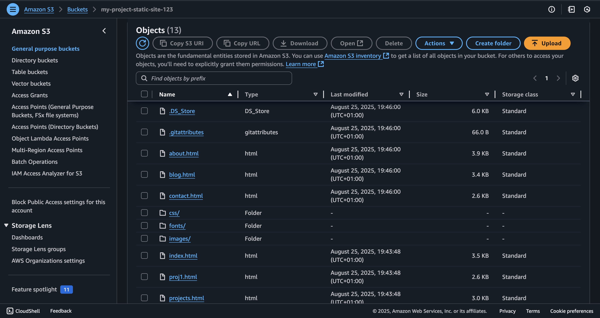
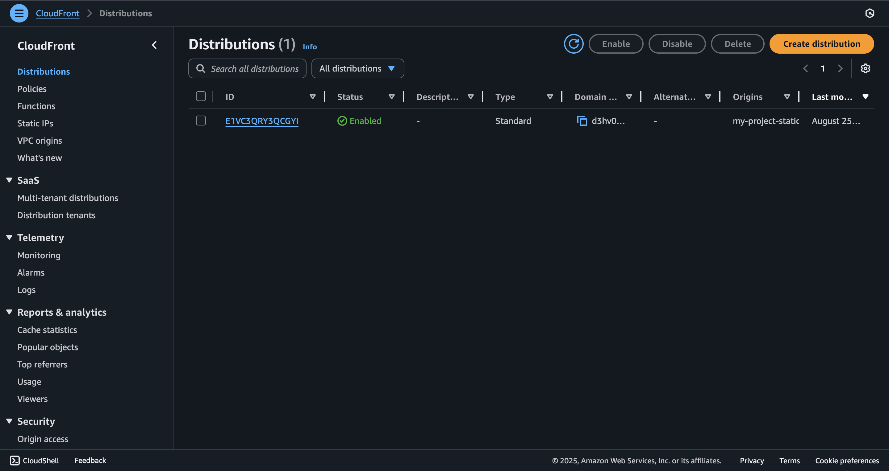
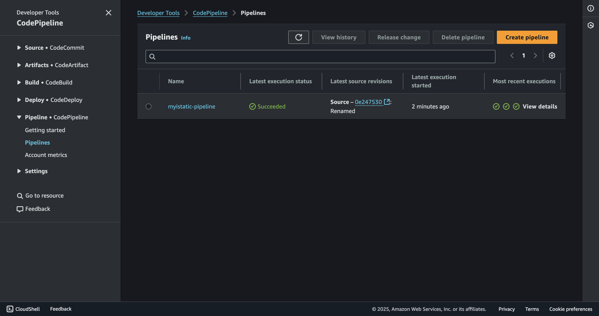

# 🌍 Static Website Hosting on AWS with CI/CD

This project demonstrates how to **host a static website on AWS S3** and automate deployment with **CodePipeline**, while accelerating content delivery using **CloudFront**.  

It is part of my **Cloud Engineering Bootcamp Projects**.

---

## 🚀 Project Overview

- **Goal** → Host a simple static website with CI/CD from GitHub.  
- **AWS Services Used**:
  - **S3** → Website storage & hosting.
  - **CloudFront** → Content delivery network (faster + secure).
  - **CodePipeline** → Automates deployments.
- **Outcome** → Each time I push code to GitHub, my website updates automatically.

---

## 🛠️ Architecture

```text
[ GitHub Repo ]
       |
       v
[ CodePipeline ] ---> [ S3 Bucket ] ---> [ CloudFront Distribution ] ---> User Browser
````

---

## 📂 Repository Structure

```
my-static-site/
├── index.html      # Main website page
└── README.md       # Documentation (this file)
```

---

## 📝 Setup Instructions

### 1. Create S3 Bucket

* Go to **S3 → Create bucket**.
* Bucket name must be unique (e.g., `my-static-site-12345`).
* Disable "Block all public access".
* Enable **Static Website Hosting**.
* Upload `index.html`.

### 2. Enable Static Website Hosting

* In **S3 → Properties → Static website hosting**.
* Set index document = `index.html`.
* Copy the endpoint link → your site is live 🎉.

### 3. Add CloudFront CDN

* Go to **CloudFront → Create Distribution**.
* Choose your S3 bucket as origin.
* Wait for deployment (\~10 minutes).
* Copy CloudFront URL → faster + secure website.

### 4. Configure CI/CD

* Go to **CodePipeline → Create Pipeline**.
* Source = GitHub repo.
* Deploy = S3 bucket.
* Every push → auto deploy to S3.


---

## 📸 Screenshots (Add Yours)

* **S3 bucket with index.html**
  

* **Website Live on CloudFront**
  

* **CodePipeline Successful Run**
  

---

##  Clean Up (To Avoid Costs)

1. Delete CloudFront Distribution.
2. Delete S3 bucket.
3. Delete CodePipeline projects.

---

##  Learning Outcomes

* Hosting static websites with S3.
* Using CloudFront for CDN.
* Setting up CI/CD with CodePipeline.
* Documenting projects for portfolio.

---

## Author

**ObaTheDev** – Cloud Engineer 🚀


